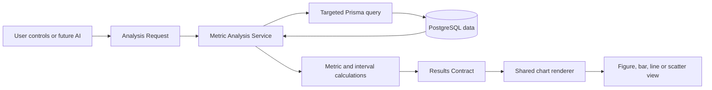

# BFshop

BFshop is an experimental eCommerce intelligence system built around a simulated online store.

The project explores a simple question: **can an analytics system help a merchant understand what matters without overwhelming them with dashboards, or requiring them to already know what question to ask?**

BFshop combines a working customer storefront, merchant operations, a synthetic economy and a flexible analytics pipeline. The long-term goal is an intelligence workspace that can investigate business data deterministically, explain useful findings in plain language and connect those findings to possible action.

**Live project:** [bfshop.benfosterdev.com](https://bfshop.benfosterdev.com/)

## Why I am building it

Traditional analytics products often expose large quantities of charts and numbers while leaving the user responsible for knowing what to inspect and how to interpret it.

BFshop is being built around a different set of principles:

- Surface useful information without waiting for the perfect question.
- Keep statistical and technical complexity behind an understandable interface.
- Let an interested merchant explore deeply without forcing every user into a dense dashboard.
- Use deterministic querying and calculation for reliable answers, with AI later used to explain, investigate and converse about those answers.
- Connect findings to potential business actions rather than treating presentation as the endpoint.

The simulated store gives the project a controlled environment in which customers, orders and purchasing behaviour can generate an evolving dataset. That makes it possible to build and test the analytical machinery before connecting it to a real business.

## The goal

The intended merchant experience has two complementary paths:

1. **Direct exploration** — configure metrics, periods, filters, breakdowns and comparisons through the Intelligence Interface.
2. **Guided investigation** — ask questions conversationally or receive proactive findings, with the same underlying analytical machinery providing the evidence.

Both paths should resolve through the same deterministic contracts and services. AI should not invent business figures or bypass application rules; it should use trusted analytical results as context.

## A reliable structure for creating charts

The chart architecture is built around two shared data contracts:

- The **Analysis Request (AR)** describes what information is wanted.
- The **Results Contract (RC)** describes how the calculated information can be presented.



### 1. Analysis Request

The request carries the analytical intent in a typed structure:

- metric or derivation;
- optional date range and day, week or month interval;
- filters such as gender, age, neighbourhood, product and product category;
- an optional breakdown;
- an optional comparison of metric, period or filter value.

This means the interface does not call metric-specific chart code. Changing a control changes the request.

### 2. Metric Analysis Service

The service validates the request, builds a targeted database query and retrieves only the records required for that analysis. It then:

- creates the requested groups;
- separates records into time intervals where required;
- calculates the metric or derivation for each group;
- constructs a Results Contract.

Database selection, grouping and business calculations remain behind the API rather than being recreated in the browser.

### 3. Results Contract

Every valid result returns the same presentation-oriented shape:

- a generated title;
- the appropriate chart type;
- metric and interval identity;
- x- and y-axis definitions and units;
- one or more labelled series containing plotted points.

The chart renderer does not need to understand whether those series came from a basic metric, derivation, breakdown or comparison. It only needs to understand the contract.

### 4. Shared chart renderer

One frontend renderer maps the contract onto figures, bars, lines or scatter plots. It handles axis formatting, currency and count units, multiple series, responsive labels, series visibility and frontend-only zooming.

This separation makes chart creation repeatable:

```text
new request option
→ calculation support
→ the same Results Contract
→ the same chart renderer
```

Adding a new metric therefore does not require creating a new chart component. The same pipeline can later serve manual controls, saved views, an AI conversation or an automated investigative system.

## Current analytical capability

The Intelligence Interface currently supports:

- Revenue, orders and items sold.
- Average order value, average items per order and average item value.
- Daily, weekly and monthly time series.
- Gender, age, neighbourhood, product and product-category filters.
- Breakdowns across those dimensions.
- Comparisons between metrics, periods or alternative filter values.
- Automatic selection of figures, bars or lines according to the returned result.
- Reusable saved views and interactive chart controls.

## The synthetic economy

BFshop continuously produces test data through n8n workflows and the application API.

Generated customers have demographic properties and behavioural traits. Existing customers are selected to make purchases, their willingness to buy determines whether an order is created, and their spending tendency influences its value. Age, gender and neighbourhood can also influence product selection. Orders then enter the same backend and merchant workflow as manually placed orders.

This creates known tendencies that later analysis can attempt to detect, distinguish from noise and explain.

## Project structure

BFshop is being developed as a series of vertical slices:

1. **Place Order** — customer storefront and order creation.
2. **Manage Orders** — merchant order lifecycle from received to delivered.
3. **Metrics and History** — requesting, calculating and presenting business metrics.
4. **Findings and Relationships** — deterministic detection of noteworthy changes and patterns.
5. **Intelligence Interface** — merchant exploration, AI-guided investigation and explanation.

The repository also contains an extensive project portal documenting the decisions, revisions and reasoning behind these slices.

## Technology

- Next.js and React
- TypeScript
- Tailwind CSS and Material UI
- MUI X Charts
- Prisma
- Neon PostgreSQL
- n8n workflow automation
- Vercel

## Run locally

```bash
npm install
npm run dev
```

Open [http://localhost:3000](http://localhost:3000).

Useful commands:

```bash
npm run build
npm run lint
npm run start
```

Environment variables are required for the project databases and protected automation endpoints. They are intentionally not committed to the repository.

## Documentation

- [Architecture](docs/architecture.md)
- [Chart and analysis architecture](docs/chart-analysis-architecture-notes.md)
- [Analytics architecture discussion](docs/analytics-architecture-discussion-summary.md)
- [Product scope](docs/product-scope.md)
- [Design system](docs/design-system.md)
- [Animation specification](docs/animation.md)

## Status

BFshop is an active learning and development project. The operational store, synthetic economy and configurable chart pipeline are working foundations. The investigative and conversational intelligence layers are the next major stages rather than finished features.
